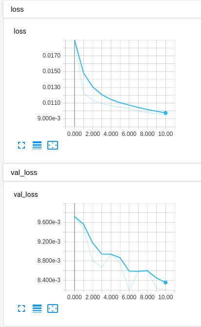
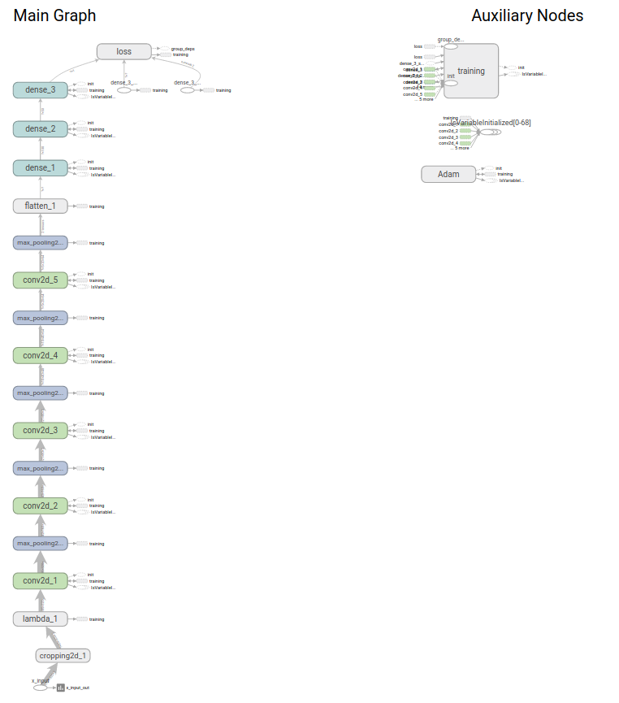
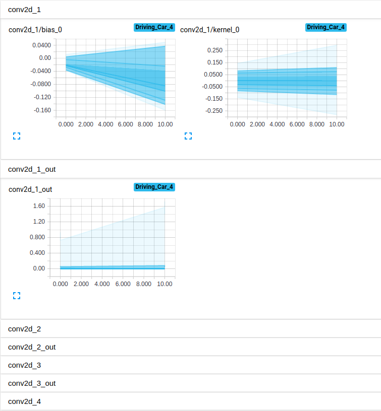

# Self Driving Car on Simulator

### Quick Start

**安裝：**
系統要求：ubuntu
1. 模擬器
  ```shell
    wget https://d17h27t6h515a5.cloudfront.net/topher/2017/February/58ae46bb_linux-sim/linux-sim.zip
    unzip linux-sim.zip
    chmod a+x linux_sim.x86_64 
  ```

2. 自動駕駛專案 

    ```shell
    git clone https://github.com/KUASWoodyLIN/Udacity-self-driving-car-challenge-3.git
    ```


**模擬器使用介紹： ** [Link](https://towardsdatascience.com/introduction-to-udacity-self-driving-car-simulator-4d78198d301d)

**drive.py：**

`python drive.py model.h5`

`python drive.py model.h5 run1`		# 儲存自動駕駛影像

**video.py**

`python video.py run1`				# 預設 fps=60

`python video.py run1 --fps 48`

---

### 專案的路徑布局

```
Udacity-self-driving-car-challenge-3/
├── __init__.py
├── README.md
├── drive.py					# 模擬器-自動駕駛的程序
├── video.py					# 產生Video的程序
├── video.mp4					# 執行結果
├── model.h5					# 網絡模型
├── model.py					# training model
├── LICENSE
└── examples/
    ├── placeholder.png
    └── placeholder_small.png
```

---

### 網絡模型架構與訓練策略

1. 模型架構

   這次的模型架構我有嘗試過Lenet、VGG16(改)、[Nvidia paper](https://arxiv.org/pdf/1604.07316v1.pdf)等等，最終決定使用Nvidia因為使用的參數不會太多也能得到良好的結果，最後測試連續跑好幾圈都沒問題。

   還有其他的網絡架構可以嘗試：[comma ai paper](https://arxiv.org/pdf/1608.01230.pdf)、[comma ai code](https://github.com/commaai/research/blob/master/train_steering_model.py)

2. 避免過擬合

   - 使用dropout方法避免過擬合。雖然在還沒加上dropout的Nvidia的網絡架構已經可以很好的完成自動駕駛，但加了後loss還是有稍稍降低。
   - 使用EarlyStopping與ModelCheckpoint，當訓練超過4輪val_loss沒有下降就會停止訓練，並存下val_loss最低的model。

3. 模型參數調整

   - 預處理：

     Cropping將照片中不必要的資訊移除掉。

     `crop = Cropping2D(((55,20),(0,0)))(x_input)`

     mean normalization，將輸入除255再減去0.5。

     `normalize = Lambda(lambda x: (x /255.0) - 0.5)(crop)`

     *注意：這部份需要使用Lambda來加入網絡層，不能直接在網絡外面normalization，因為在simulator中並部會輸入normalization過後的資訊*。

   - 優化器：使用預設adam。

4. 適當的訓練資料

   - 自己使用模擬器收集更多的訓練數據，並將自己收集的資料與原本資料合併。
   - 將左、右兩個相機照片拿來訓練，並使用中間照片的轉向+-0.5為左右照片轉向，**主要目的在於增加汽車轉向的資料量，避免訓練資料絕大部分都是直線資料的問題**。
       ```python
       # image path
       img_center = os.path.join(IMAGES_DIR, line[0].split('/')[-1])
       img_left = os.path.join(IMAGES_DIR, line[1].split('/')[-1])
       img_right = os.path.join(IMAGES_DIR, line[2].split('/')[-1])
       x_data.append(img_center)
       x_data.append(img_left)
       x_data.append(img_right)

       # steering angle
       steering_center = float(line[3])
       correction = 0.25  # this is a parameter to tune
       steering_left = steering_center + correction
       steering_right = steering_center - correction
       y_data.append(steering_center)
       y_data.append(steering_left)
       y_data.append(steering_right)
       ```
   - 將資料翻轉，能增加一倍的資料量。
       ```python
       img = cv2.imread(img_path)
       img = cv2.cvtColor(img, cv2.COLOR_BGR2RGB)
       x_batch.append(img)
       y_batch.append(steer)
       img_flip = cv2.flip(img, 1)
       x_batch.append(img_flip)
       y_batch.append(-steer)
       ```

5. 生成器 generator

   此用原本的方法一次性將資料全部讀入會使用到很大量的記憶體，一般的電腦可能承受不了，所以使用generator可以分批次將資料讀入訓練可以解決以上問題，但會影響訓練速度。

6. Tensorboard

   Tensorflow提供可以可視化訓練過得的工具，不同於課堂上介紹的方法，使用Tensorboard可以即時監控 Loss、weight、bias變換，如果即時發現錯誤可以將程序停止下來，還有提供其Graphs、Embedding等強大功能。

   - Loss顯示

     

   - Graph 網路架構圖

     

   - 權重參數分佈

     